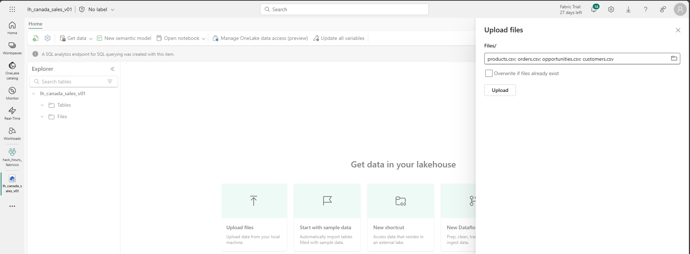

# 🏆 Hack Hours – AI/ML Edition – Genie + Fabric Data Agent

Welcome to the **Compete Hack Hours – AI/ML Edition**!  
This repository contains all resources and setup guides to prepare your environment in **Databricks Genie** and **Microsoft Fabric** for hands-on exploration of AI/BI.  

---

## ✅ Prerequisites
Before starting, make sure you have:  
 🔹 An active **Databricks workspace** with Unity Catalog enabled.  
 🔹 Access to **Microsoft Fabric** with at least **F2 capacity**.  

---

## 📋 Agenda
1. Welcome & Kickoff  
2. From BI → AI/BI vision  
3. AI/BI in Databricks  
   - What it is + Dashboard demo  
4. Databricks Genie  
   - Conversational analytics + demo  
5. Cross-Platform View  
   - Genie (BI insights) vs. Fabric Data Agent (data exploration)  
6. Wrap-Up & Resources  

---

## 🚀 Setup Part 1 – Databricks (Genie)

### 1. Open the **Catalog**
  
Go to **Catalog** → **Add data → Create a catalog**.  

### 2. Create a Catalog
  
- Name: `hack_hours_dbws`  
- Type: `Standard`  
- Storage: default workspace location  
- Click **Create**  
  
✅ You’ll see *Catalog created!*  

### 3. Create a Schema
  
- Inside your catalog, click **Create schema**  
- Name: `v01`  
- Storage auto-fills → `hack_hours_dbws/v01`  

### 4. Create a Table
  
- **Create → Table**  
- Upload `products.csv`  
- Catalog: `hack_hours_dbws` | Schema: `v01` | Table: `products`  

### 5. Verify Table
  
Check columns: `productid`, `productname`, `listprice`  
Databricks will suggest an **AI description** for the table.  

### 6. Add More Tables
  
Repeat for `customers`, `orders`, `opportunities`.  

### 7. Run Queries
```sql
SHOW TABLES IN hack_hours_dbws.v01;
```

```sql
SELECT * FROM hack_hours_dbws.v01.products LIMIT 5;
```


#### Where to run these queries in Databricks

You can execute the SQL above in Databricks using any of the following:

- Databricks SQL (SQL Editor)
  - Open the SQL workspace (SQL in the left nav).
  - Connect to a running SQL warehouse.
  - Create a new query, paste the SQL, and click Run.

- Databricks Notebook
  - Create/open a notebook and either:
    - Set the notebook language to SQL and paste the queries into cells, or
    - Use SQL cell magic:
```sql
%sql
SHOW TABLES IN hack_hours_dbws.v01;
```
    - Or run via Spark in Python:
```python
%python
display(spark.sql("SELECT * FROM hack_hours_dbws.v01.products LIMIT 5"))
```
  - Attach the notebook to a running cluster.

- Data Explorer / Table preview
  - Go to Data -> Tables, locate hack_hours_dbws.v01.products and use the Preview or Query Table option.

Notes and tips:
- If using Unity Catalog, keep using fully qualified names (catalog.schema.table) as shown.
- Ensure you have the required permissions and a running SQL warehouse or cluster.
- To avoid fully-qualified names in a session, you can set a default catalog/schema:
```sql
USE CATALOG hack_hours_dbws;
USE SCHEMA v01;
```

---

## 🚀 Setup Part 2 – Microsoft Fabric

### 1. Create a Workspace
  
- New workspace → Name: `hack_hours_fabricws`  
- Select **Fabric capacity**  
- Apply  

### 2. Create a Lakehouse
  
- New item → **Lakehouse**  
- Name: `lh_canada_sales_v01`  

### 3. Upload Data
  
Upload: `products.csv`, `customers.csv`, `orders.csv`, `opportunities.csv`.  

  

### 4. Load Files into Tables
 
Right-click each CSV → **Load to Tables → New table**.  

### 5. Verify Tables
 
Tables `products`, `customers`, `orders`, `opportunities` should appear under **Tables**.  

### 6. Create a Semantic Model
  
- In your Lakehouse workspace, click **New semantic model**.  
- Select the tables you loaded (`products`, `customers`, `orders`, `opportunities`).  
- Click **Create** to generate the semantic model.  
- You can now use this model for Power BI reports and AI-powered insights in Fabric.  

---

## 🔄 Cross-Platform Comparison

- **Databricks Genie** → Conversational BI, dashboard-driven insights.  
- **Fabric Data Agent** → Natural language data exploration (SQL/DAX/KQL).  

During the Hack Hour, you’ll explore both platforms, compare features, and experience **AI-powered analytics in action**.  

---

## 📚 Resources
- [Databricks AI/BI](https://learn.microsoft.com/en-us/azure/databricks/ai-bi/)  
- [Databricks Dashboards](https://learn.microsoft.com/en-us/azure/databricks/dashboards/) 
- [Databricks Genie](https://learn.microsoft.com/en-us/azure/databricks/genie/)  
- [Microsoft Fabric Data Agent](https://learn.microsoft.com/en-us/fabric/data-science/concept-data-agent)  
- [Unity Catalog Docs](https://learn.microsoft.com/azure/databricks/data-governance/unity-catalog/)  
- [Fabric Lakehouse Docs](https://learn.microsoft.com/fabric/data-engineering/lakehouse-overview)  

---

## ✅ You’re Ready!
Your environments in **Databricks** and **Fabric** are set up.  
Let’s Hack! 🚀
